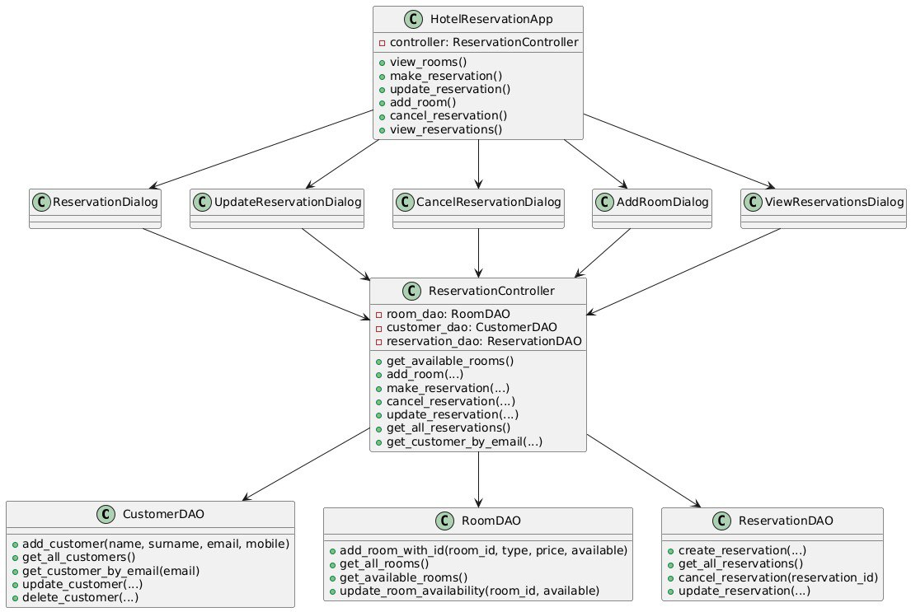

# 🏨 Hotel Reservation System

This project is a Hotel Room Reservation System developed as a final Object-Oriented Programming (OOP) project. It is designed to facilitate hotel room bookings for customers and manage reservations efficiently. The system aims to streamline the booking process, provide an intuitive user interface, and ensure smooth hotel operations through effective room management.

## 👥 Our Team
- [Aliya Asanova](https://github.com/AliyaAsanova) (AliyaAsanova): 🧠 Backend Developer 
- [Madina Gabbazova](https://github.com/vinw777) (vinw777): 🎨 Project Manager
- [Gulum Manasova](https://github.com/GulumManasova) (GulumManasova): 🗄️ Database Administrator

## 📂 Structure

hotel_reservation/

├── controller.py       
├── model.py           
├── view.py             
├── hotel_reservation.db  
├── resources/          
└── README.md   

- # controller.py 
    [reservation_controller.py](/oop_project/OOP_project/reservation_controller.py) : Implements controller logic (MVC). Connects UI actions to database operations using DAOs.

-  # model.py 
    [room_dao.py](/oop_project/OOP_project/room_dao.py) : DAO for rooms. Handles room creation, retrieval, and updating availability.

    [customer_dao.py](/oop_project/OOP_project/customer_dao.py) : Data Access Object for customers. Supports creating, reading, updating, and deleting customer records
    
    [reservation_dao.py](/oop_project/OOP_project/reservation_dao.py) : DAO for reservations. Supports CRUD operations for reservation records, including cost calculations.
hotel_reservation.db | SQLite database file. Stores data for customers, rooms, and reservations

    [test_customer_dao.py](/oop_project/OOP_project/test_customer_dao.py) : Unit test for CustomerDAO. Adds test customers and checks they are correctly stored in the database.

    [test_reservation_dao.py](/oop_project/OOP_project/test_reservation_dao.py) : Test script for ReservationDAO. Adds a sample reservation and prints all reservations.

    [test_room_dao.py](/oop_project/OOP_project/test_room_dao.py) : Test script for RoomDAO. Adds a test room, then displays all and available rooms.

- # view.py
    [view.py](/oop_project/OOP_project/view.py)  : Main GUI logic. Connects buttons from the UI `qtdesign4_ui.py` to actions like viewing rooms, making reservations, etc.

    [qtdesign4.ui](/oop_project/OOP_project/qtdesign4.ui)  : UI layout created in Qt Designer. Defines button positions, styles, and structure of the main window

    [qtdesign4_ui.py](/oop_project/OOP_project/qtdesign4_ui.py) :  Auto-generated Python code from the .ui file. Used to build the interface with PyQt6.
    
    [dialogs.py](/oop_project/OOP_project/dialogs.py) : Contains all functional dialog windows (Make Reservation, Update, Cancel, Add Room, View Reservations) with forms and tables.

- # DB
    [hotel_reservation.db](/oop_project/OOP_project/hotel_reservation.db)

 - # resources
    [images](/oop_project/OOP_project/images/)
 
 - # README.md
    [README.md](/oop_project/OOP_project/README.md)

- # main.py 
    [main.py](/oop_project/OOP_project/main.py) : Launches the application. Initializes the PyQt6 app and opens the main window (HotelReservationApp)

## UML Class diagram

## Weekly Meeting Documentation
[Meeting Documentation](files/Hotel_Reservation_Weekly_Meetings.docx)